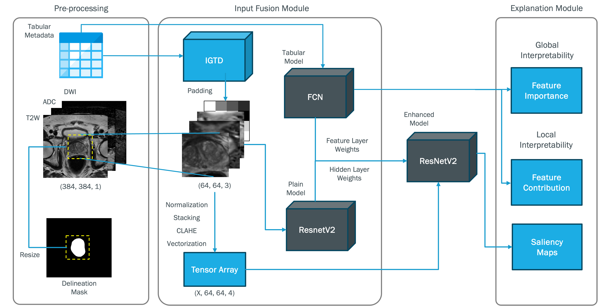

# Multimodal Deep Learning and Explainable AI for Enhanced Prostate Lesion Classification Official Repository
This is the repository for "Integrating Multimodal Deep Learning and Explainable AI for Enhanced Prostate Lesion Classification".
## Abstract
Artificial Intelligence holds immense promise in healthcare, offering opportunities to enhance disease diagnosis, treatment selection, and clinical testing. However, the lack of interpretability in AI systems poses a significant challenge, potentially impeding their adoption. In our paper, we address this issue by proposing an analytical framework that leverages a multimodal deep learning approach for the classification of prostate lesions using Magnetic Resonance Imaging (MRI) data and patient clinical information.

We first present a multimodal deep learning model that integrates MRI data and patient metadata to classify prostate lesions. This model aims to improve diagnostic accuracy while maintaining interpretability. Subsequently, we introduce a multimodal explainable artificial intelligence (XAI) approach, employing visual explanations to elucidate the decision-making process of our proposed model. This approach allows us to identify how different modalities contribute to each specific prediction, enhancing trust and understanding.

Our experiments, conducted on the PI-CAI Grand Challenge dataset, demonstrate the potential of combining multimodal data and XAI techniques to advance prostate cancer diagnosis. By integrating MRI data such as Apparent Diffusion Coefficient (ADC), T2-weighted (T2w), and Diffusion-Weighted Imaging (DWI), along with tabular metadata, and employing a convolutional neural network enhanced by transfer learning, our study offers improved predictive performance, reliability, and interpretability in medical diagnostics and treatment decisions.

## Dataset
The dataset used for the analysis is the one provided for the [PI-CAI Grand Challenge](https://pi-cai.grand-challenge.org)  
Imaging data is available at [Zenodo](https://zenodo.org/records/6624726)\
Annotations have been released and are maintained via this [GitHub Repository](https://github.com/DIAGNijmegen/picai_labels)

## Workflow

## Repository Contents

- `black_box/`: Directory containing scripts related to the black box image classifier.
  - `code/`: Subdirectory containing additional scripts with utility functions developed for the project.
    - `IGTD_Functions.py`
    - `array_creation_stacking_utils.py`
    - `crop_data_utils.py`
    - `dataset_creation_utils.py`
    - `mapping_train_test_split_utils.py`
    - `model_training_utils.py`
  - `notebooks/`: Subdirectory containing Jupyter notebooks with the project workflow.
    - `0.lesion_EDA.ipynb`
    - `1.crop_data.ipynb`
    - `2.mapping_train_test_split.ipynb`
    - `3.1.dataset_creation.ipynb`
    - `3.2.tab_to_images.ipynb`
    - `3.3.array_creation_stacking.ipynb`
    - `4.model_training.ipynb`
    - `5.1.visual_explanation_module.ipynb`
    - `5.1.quantitative_explanation_module.ipynb`
- `images/`: Subdirectory containing the images created for the study. 
- `LICENSE`: The Project License
- `README.md`: This file.

<!---
## Citation
If you find our work helpful, please consider citing our paper:
\[citation\]
-->

## Contributors (in alphabetical order) and Organizations
- [Andrea Berti](https://github.com/----)
- [Sara Colantonio](https://github.com/----)
- [Claudio Giovannoni]([https://github.com/johndoe](https://github.com/cgiova))
- [Carlo Metta](https://github.com/----)
- [Anna Monreale](https://github.com/----)
- [Francesca Pratesi](https://github.com/----)
- [Salvatore Rinzivillo](https://github.com/----)
- [University of Pisa]([https://github.com/unipisa]): Organization
- [ISTI-CNR]((https://www.isti.cnr.it/en/)): Organization

## License
This project is licensed under the [Apache License 2.0](LICENSE).

---
This repository is maintained by the authors and contributors. We welcome any feedback or suggestions for improvement.